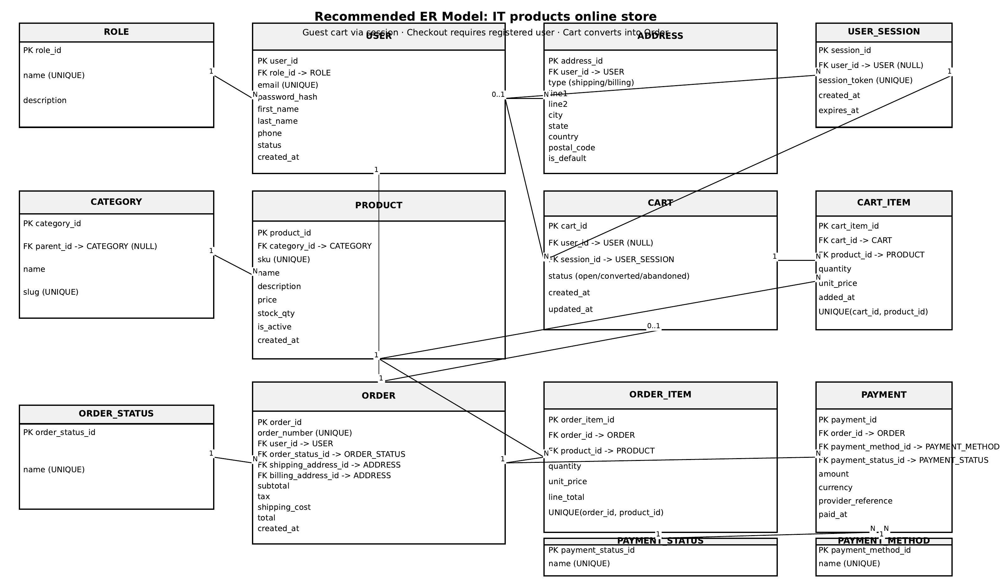

# Product Purchasing System

Sistema de compras de productos informáticos online - Proyecto educativo Backend II

> **Note:** This repository contains the project up to ETAPA06 - the architectural decision point between JPA/EntityManager and Spring Framework.

## 📋 Descripción

Sistema de tienda online que permite:
- Gestión de usuarios registrados y roles
- Carrito de compras para invitados (guest)
- Registro/inicio de sesión obligatorio para checkout
- Catálogo de productos y categorías
- Gestión de órdenes y pagos
- Merge automático de carritos al registrarse

## 🏗️ Estructura del Proyecto por Etapas

Este proyecto se desarrolla en **3 etapas progresivas** usando ramas Git independientes:

### 📌 `main` - Estructura inicial
Configuración Maven básica y estructura de directorios

### 📌 `etapa01` - Entidades básicas (POJOs sin relaciones)
- 14 entidades del modelo E-R como clases Java simples
- Solo atributos primitivos, String, LocalDateTime, BigDecimal
- IDs como `Long` (sin referencias a objetos)
- Constructores, getters, setters, toString()
- 4 enums para estados y tipos

### 📌 `etapa02` - Relaciones y métodos de negocio
- Relaciones entre entidades (objetos en lugar de IDs Long)
- Colecciones bidireccionales (List)
- Métodos de negocio (calculateTotal, addItem, etc.)
- Validaciones básicas en setters
- Manejo de referencias circulares en toString/equals/hashCode

### 📌 `etapa03` - JPA/Hibernate + MySQL (Futuro)
- Anotaciones JPA (@Entity, @ManyToOne, @OneToMany, etc.)
- Estrategias Lazy/Eager loading
- Configuración Hibernate + MySQL
- Lombok para reducir boilerplate
- Variables de entorno para configuración DB
- Bean Validation API
- Ver [ROADMAP.md](ROADMAP.md) para detalles

## 🗂️ Modelo E-R

El modelo completo está documentado en [`documents_external/er_model_documentation.md`](documents_external/er_model_documentation.md)

**Diagrama E-R:**



**14 Entidades:**
1. `Role` - Roles de usuario (admin, customer)
2. `User` - Usuarios registrados
3. `Address` - Direcciones de envío/facturación
4. `UserSession` - Sesiones (incluye invitados)
5. `Category` - Categorías de productos (jerarquía)
6. `Product` - Productos vendibles
7. `Cart` - Carritos de compra
8. `CartItem` - Items del carrito
9. `OrderStatus` - Catálogo de estados de orden
10. `Order` - Órdenes de compra
11. `OrderItem` - Items de la orden
12. `PaymentStatus` - Catálogo de estados de pago
13. `PaymentMethod` - Catálogo de métodos de pago
14. `Payment` - Transacciones de pago

## 🚀 Cómo usar este repositorio

### Clonar el repositorio
```bash
git clone git@github.com:lgoenaga/product-purchasing-system-spring.git
cd product-purchasing-system-spring
```

### Ver las diferentes etapas
```bash
# Ver todas las ramas
git branch -a

# Cambiar a etapa 1
git checkout etapa01

# Cambiar a etapa 2
git checkout etapa02

# Volver a main
git checkout main
```

### Compilar el proyecto
```bash
mvn clean compile
```

## 📚 Documentación adicional

- **Modelo E-R completo:** [`documents_external/er_model_documentation.md`](documents_external/er_model_documentation.md)
- **Diagrama visual:** [`documents_external/modelo_er_store.png`](documents_external/modelo_er_store.png)
- **Roadmap Etapa 3:** [`ROADMAP.md`](ROADMAP.md) (se creará en etapa02)

## 🎯 Características clave del modelo

### Carrito de invitado
- Los usuarios no registrados pueden agregar productos
- Se identifica por `session_id`
- Se requiere registro para completar checkout

### Cart Merge (Política obligatoria)
Cuando un invitado se registra y ya tiene un carrito abierto:
1. Se fusionan los carritos (suma de cantidades)
2. Se conservan items únicos
3. El carrito invitado se marca como `abandoned`
4. El usuario continúa con un único carrito activo

Ver detalles en sección 5 de [`er_model_documentation.md`](documents_external/er_model_documentation.md)

## 🛠️ Tecnologías

- **Java 17**
- **Maven** para gestión de dependencias
- **LocalDateTime** para fechas
- **BigDecimal** para valores monetarios
- **(Futuro)** Hibernate/JPA, MySQL, Lombok, Bean Validation

## 👥 Autor

Luis Goenaga - Proyecto educativo Backend II - CESDE

## 📄 Licencia

Proyecto educativo - 2026
